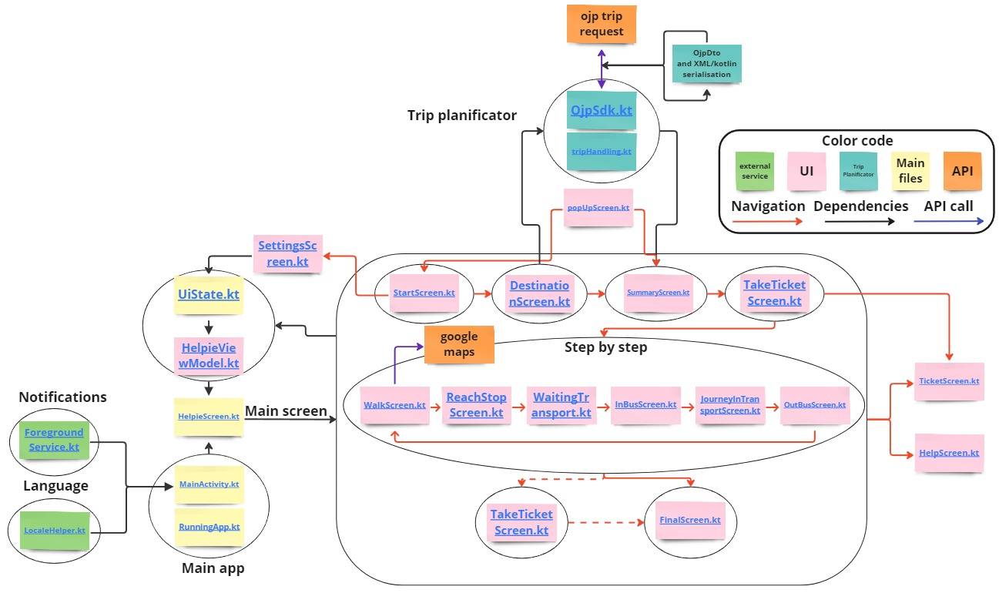

# ATC-Helpie-2024
Git repository of the App Helpie for ATC project 2024


## Table of Contents
1. [Introduction](#introduction)
2. [Features](#features)
3. [Structure](#structure)
3. [Installation](#installation)
4. [Usage](#usage)
5. [Members](#members)

## Introduction
Travelling and mobility are essential in our society. Without them, we would not be able to dis-
cover new places, peoples and ideas. We would not be able to develop and construct society and
life projects. As easy mobility is taken for granted by most of us - thanks to cars, bikes and public
transportation, etc. - we do not always realize its importance. However for some people, mobility
is difficult, which heavily impairs their independence.

In Switzerland, the SBB (Swiss Federal Railway) Mobile App is the most widely used applica-
tion to help travelling through public transportation. It features a lot of useful functionalities such
as travel planning, real time information about schedule and location as well as ticket buying. How-
ever, this makes the application complex and inaccessible for certain people.

As the SBB are concerned by inclusiveness they have developed a second application: ”SBB Inclu-
sive” providing additional and adapted information for people with visual or auditory impairment.
In this project, we will concentrate on a different kind of condition: cognitive impairment. For
individuals experiencing cognitive challenges,the complexity and high density of stimuli found in
the public transportation system and SBB Mobile App can be overwhelming.

The Helpie App is an idea that was initially brought by P lusSport: an association that tries
to gather people with all kinds of disabilities in sport events. They realized that one of the biggest
challenges for people with cognitive impairment was the transportation of the different people to-
wards the site of the event and that the SBB Mobile App was not adequately adapted. They
therefore brought the concept of a simplified and adapted app to the Hackathon, a project that was
made in collaboration with several railway companies like the SBB, but also the SNCF, OBB and
the DB (respectively the french, austrian and german railway biggest representatives). Within a
week-end, they developed some ideas and the mock-up of an app.

Helpie then eventually landed in our hands: the Assistive Technology Challenge, an EPFL-project
whose primary goal is to develop a personalized solution for a person with disabilities. We were
assigned a challenger that lies on the autistic spectrum, let’s name him Charlie, and regularly met
with him to adapt the progress of Helpie.

## Features
OurChallenger wanted an application with as few stimuli as possible, but with enough information to do a full journey. The following design choices were therefore taken in order to develop a simple app that would guide him through a journey:

1. **Global Theme**: We decided to keep the blue chosen by the first HackaHealth for the global theme. We aimed to create a clean and straightforward interface. Every element is designed to be easily understandable and accessible thanks to the color contrasts and the button shapes.

2. **Start Screen**: A start screen leads the user to the choice of destination. For starting the trip, a set of four pre-registered relevant addresses are displayed, like "Home", "Work", or "Sport", so that he does not have to bother with entering the address. An additional feature would, however, permit to do so if needed.

3. **Journey Summary**: The journey summary is displayed with the estimated time of arrival and a description of each step. To follow on the journey, the user needs to click on the START button ("Commencer"). There is also a grey Back button ("retour") if one wants to change the destination, e.g., because of a previous misclick.

4. **Take a Ticket**: We have two interfaces to remind the user to take their ticket. The choice of this interface can be made using the settings. The first screen that we decided to implement tells the user to take an "easy-ride" ticket using the official SBB application. By clicking on "Prendre le billet," the user will be transferred to the SBB app directly in the easy-ride section and only needs to drag the button to the right (explained on the screen). The ticket will automatically be taken and calculate its price by looking at the ongoing trip. However, if Charlie already has a ticket, in those situations, we activate the other version of this interface, which reminds him to stamp his ticket.

5. **Step-by-Step Instruction**: A step-by-step journey, where we try to detail the trip as much as possible while giving only the necessary information each time to not saturate the screen with too many stimuli. Therefore, all steps are given in chronological order, one-by-one where the only possible interactions are to go forward through the trip or to interrupt the journey.

   * For walking travels, for example, to go to the next bus stop, Google Maps will be launched with the adequate destination. Charlie is quite used to dealing with satellite maps, especially with Google Maps when he walks and requested it.
   * For public transport, essential information is clearly displayed such as the waiting time, the ID, estimated time of arrival (ETA), direction of the transportation as well as the type of transportation.
6. **Appropriate Notifications and Warnings**: Two types of notifications have been implemented in order to remind Charlie to go back to Helpie if he uses another app as well as giving him the appropriate reminders to go in/out of transportation, for instance:

    * When leaving the app, a blue movable square will still be on the screen to remind the user of the ongoing travel and allow them to go back easily to Helpie (see fig. []). 
    * Two minutes before the arrival, a yellow notification will pop up to warn the user to be ready for the change of transport (see fig. []). The same type of notification will pop up when arriving at the destination of a checkpoint (e.g., the bus stop or train station).
7. **Help Button**: A help button is always displayed (see fig. []), so that the user can easily call someone if they happen to be in a dire or stressful situation.

8. **Settings**: On the menu page, a settings button is available (see fig. []) that will allow a close relative or the caregiver to personalize the user's experience. This button is for now accessible only on the start screen.

9. **Progress Bar**: To help the user engage and use the app, a gamified progress bar was added to the display (see fig. []).

## Structure
```
ATC-Helpie-2024/Helpie2/app/src/main/java/com/example/helpie
│
└───foregroundServices (Notification and window)
│   │
│   └───ForegroundService (Notification and window)
│
└───tripPlanificator (Trip Planification API)
│   │
│   └───OjpSdk
│   │
│   └───tripHandling.kt (Trip Planification API)
│   │
│   └───...
│
└───ui
│   │
│   └───DestinationScreen.kt 
│   │
│   └───FinalScreen.kt
│   │
│   └───HelpieViewModel 
│   │
│   └───HelpScreen.kt
│   │
│   └───InBusScreen.kt 
│   │
│   └───JourneyInTransportScreen.kt
│   │
│   └───OutBusScreen.kt
│   │
│   └───PopUpStop.kt
│   │
│   └───ReachStopScreen.kt
│   │
│   └───SettingsScreen.kt
│   │
│   └───StartScreen.kt
│   │
│   └───StepScreen.kt
│   │
│   └───SummaryScreen.kt
│   │
│   └───TakeTicketScreen.kt
│   │
│   └───TicketScreen.kt
│   │
│   └───WaitingTransport.kt
│   │
│   └───WalkScreen.kt
│   │
│   └───...
│
└───HelpieScreen.kt
│
└───MainActivity.kt
│
└───RunninApp
│
└───UiState.kt
│
└───...
``` 


## Installation
You can download this app by cloning this repository and opening it in Android Studio. Then build the gradle and run the app on an emulator or a physical device. 

## Usage
For usage instructions, please refer to the [user guide](<./HELPIE - Mode d'emploi - User guide.pdf>) provided in this repository which is in both french and english.

For developers, the code is structured like  the code works as follows:


Helpie had to communicate with several databases to be operational. 
First, the [SBB API](https://opentransportdata.swiss/fr/cookbook/open-journey-planner-ojp/) was needed to access the trip request service and access not only schedules but also precise locations and check-point (steps) for more complex trips. This API needs to receive an .XML file and sends back another .XML. We therefore had to implement a serialisation/deserialisation method between .XML and Kotlin, to send and interpret requests accordingly.

Secondly, the [Google Maps API](https://developers.google.com/maps/documentation/android-sdk) was necessary to access accurate current location of the user as well as for internal functionalities such as converting addresses into latitude and longitude to be able to make the trip request. This API is available in Kotlin.

However, several functionalities of these two companies were not available as API and could not directly be implemented in the app: the live turn-by-turn navigation with audio guidance for Google Maps and the buying of tickets for SBB. Therefore, it was chosen to launch these apps on the correct window and to develop a notification system that would make navigation through the different application possible and fluid.

Considering these design choices, we implemented the following solutions. Most of the files we will discuss can be found in this directory: _Helpie2/app/src/main/java/com/example/helpie_.

1. **Global Theme**: The foundational theme framework is mostly done in _HelpieViewModel_, _HelpieScreen.kt_ and _UiState.kt_. These files manage the ViewModel class, the foundational screen framework and navigation, and ViewModel variables, respectively. Each functionality relies mainly on these core UI files (see fig. \ref{fig:repo_graph}). Furthermore, the app's core structure is maintained in _MainActivity.kt_. All UI (User Interface) elements are implemented using Kotlin Jetpack Compose objects such as buttons, boxes, texts, text fields, and others.

2. **Start and Destination Screen**: We can locate the start screen at _ui/StartScreen.kt_, which adheres to the global theme and features a prominent start button. Clicking on it triggers navigation to the destination page. Here, the UI design is implemented in _ui/DestinationScreen.kt_, while destination settings are managed in _ui/SettingsScreen.kt_, providing users with text fields to input new registered destinations. To ensure long-term usability, we store the UI state of destinations as JSON files.

3. **Journey Summary**: When a destination is entered, a request is sent to the SBB API [OJP trip request](https://opentransportdata.swiss/de/cookbook/ojptriprequest/). The resulting trip is stored and used for the summary. This is done in the _tripPlanificator_ folder, utilizing the _tripPlanificator/OjpSdk_ class and the _tripPlanificator/tripHandling.kt_ file. Then, in _ui/SummaryScreen.kt_, we display the necessary information for a comprehensive summary and save trip information as step information class.

4. **Take a ticket**: To handle the two cases for the ticket, we use a boolean that can be modified in _ui/SettingsScreen.kt_ via checkboxes. All UI elements are managed in _ui/TakeTicketScreen.kt_. In the case of _EasyRide_, we send a URL link to EasyRide, which transfers the corresponding _CFF_ app feature. The file _ui/TicketScreen.kt_ takes care of the page when a ticket is chosen and follows the same logic for taking the ticket. This screen is used at the start to take the ticket and at the end to deactivate EasyRide if needed.

5. **Step by step instruction**: This features having many different pages to handle each travel steps, it required the following UI files:
    - To handle stop verification:
        - _ui/InBusScreen.kt_
        - _ui/OutBusScreen.kt_
        - _ui/ReachStopScreen.kt_
    - Waiting screen before and while a trip:
        - _ui/JourneyInTransportScreen.kt_
        - _ui/WaitingTransport.kt_
        - _ui/WalkScreen.kt_

    Each of these files uses information from the SBB API gathered previously in Journey Summary.

6. **Appropriate notifications and warning**: Both the window display and notification functionalities are designed within the _ForegroundService_ class and are implemented inside _MainActivity.kt_, along with permission requests. We use the WindowManager and ForegroundService package for these purposes. The pop-up window, when a trip is interrupted midway, is handled in _ui/PopUpStop.kt_.

7. **Help button**: The help button is always shown by putting it in the global framework in _HelpieScreen.kt_ and its screen UI is handled in _ui/HelpScreen.kt_ as well as the change of app to call a number.

8. **Two interfaces**: We implemented a Settings screen using a button on the Start page. This screen is designed in _ui/SettingsScreen.kt_ as mentioned earlier.

9. **Progress bar**: The progress bar is implemented in _HelpieScreen.kt_ and consists of a Kotlin Jetpack compose drawable which adapts to changes in the UI state _current_step_ using the _compose.runtime_ function _LaunchedEffect_.
   
For further insight, you can consult the documentation.

## Documentation
The code is documented in Kdoc and cann be generated with Dokka. The .html is available in the .zip and the documentation is also available in markdown in the [index](./documentation/index.md).

## Contact Information
Contact information for our team will be available soon.

## Members:
* Claire Payoux
* Eliser Josan Romero
* Jade Therras
* Lena Florence De Sepibus
